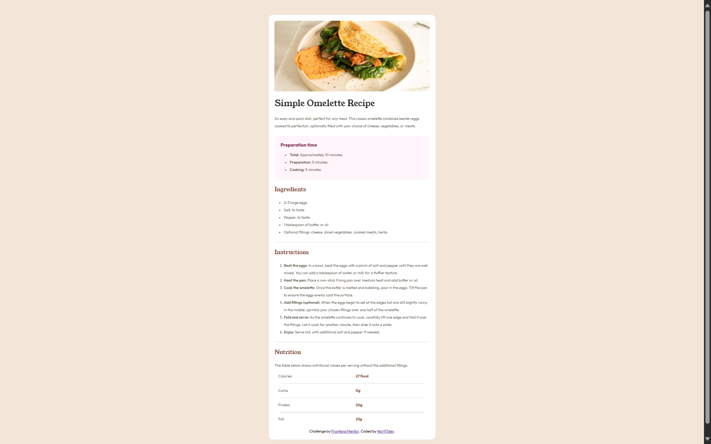

# Frontend Mentor - Recipe page solution

This my solution to the [Recipe page challenge on Frontend Mentor](https://www.frontendmentor.io/challenges/recipe-page-KiTsR8QQKm).

## Table of contents

- [Author](#author)
- [Overview](#overview)
  - [Screenshot](#screenshot)
  - [Links](#links)
- [My process](#my-process)
  - [Built with](#built-with)
  - [Useful resources](#useful-resources)
- [Front-end Style Guide](#front-end-style-guide)
  - [Layout](#layout)
  - [Colors](#colors)
  - [Typography](#typography)
    - [Body Copy](#body-copy)
    - [Fonts](#fonts)

## Author

- Personal GitHub - [Nort17dev](https://github.com/Nort17dev)

## Overview

### Screenshot

<!--  -->

### Links

- Solution URL: [Add solution URL here](https://your-solution-url.com)

## My process

### Built with

- Semantic HTML5 markup
- CSS 3 with modern features
- Desktop-first workflow
- Git and GitHub

### Useful resources

- [lenguajecss.com](https://lenguajecss.com/css/) - This website helped me with some CSS that I didn't remember. It was useful.

# Front-end Style Guide:

## Layout

The designs were created to the following widths:

- Mobile: 375px
- Desktop: 1440px

> 💡 These are just the design sizes. Ensure content is responsive and meets WCAG requirements by testing the full range of screen sizes from 320px to large screens.

## Colors

- White: hsl(0, 0%, 100%)

- Stone 100: hsl(30, 54%, 90%)
- Stone 150: hsl(30, 18%, 87%)
- Stone 600: hsl(30, 10%, 34%)
- Stone 900: hsl(24, 5%, 18%)

- Brown 800: hsl(14, 45%, 36%)

- Rose 800: hsl(332, 51%, 32%)
- Rose 50: hsl(330, 100%, 98%)

## Typography

### Body Copy

- Font size (paragraph): 16px

### Fonts

- Family: [Young Serif](https://fonts.google.com/specimen/Young+Serif)
- Weights: 400

- Family: [Outfit](https://fonts.google.com/specimen/Outfit)
- Weights: 400, 600, 700